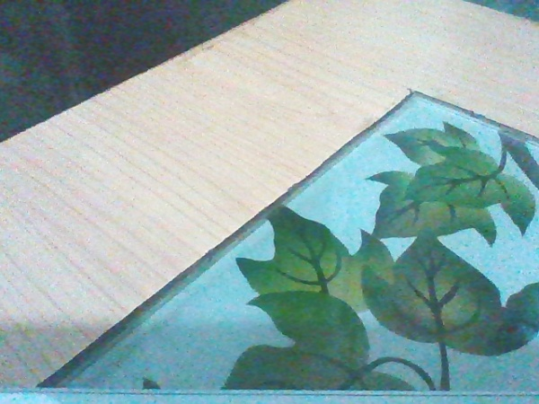
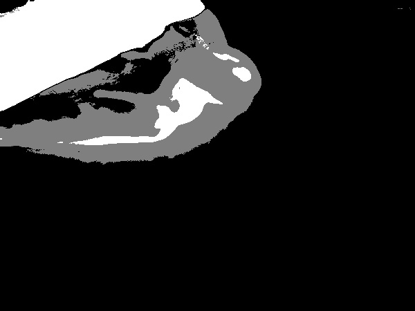
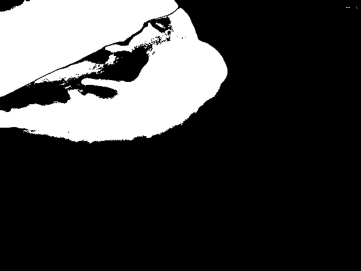
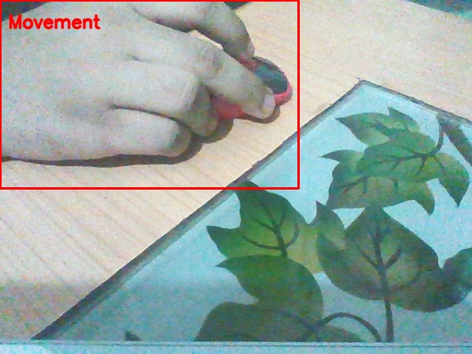

# Motion Detection And Tracking

#### When No Motion

##### *(From Left to Right)*
1. Masked-no motion
2. Thresholded-no motion
3. Webcam Feed-no motion

#### When moving objects

##### *(From Left to Right)*
1. Masked image frame-object in motion
2. Thresholded image frame-object in motion
3. Webcam Feed image frame-object in motion

## To-Dos
- [x] Read Research Papers/Blogs and Related Stuffs
- [x] Finalize Implementation Process
- [x] Start Coding
- [x] Experiment
- [x] Optimize - Test
